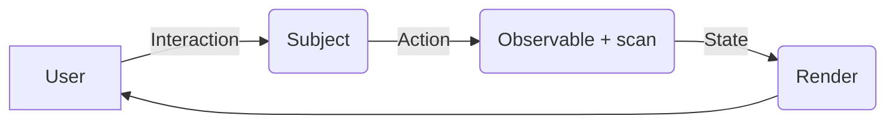

# Action - Reaction Pattern (MVI Architecture)

## 🌟 Tổng quan
Bài học này giới thiệu mô hình **Action-Reaction** (hay còn gọi là **MVI - Model View Intent**). Đây là một biến thể của Uni-directional Data Flow (Luồng dữ liệu một chiều), giúp tách biệt hoàn toàn giữa việc **người dùng muốn làm gì** (Intent) và **hệ thống xử lý thế nào** (Model).

## 💎 Giá trị cốt lõi
1.  **Tách biệt (Decoupling)**: UI không gọi trực tiếp logic xử lý. UI chỉ gửi "Intent" (tôi muốn làm A).
2.  **Dễ test**: Vì logic nằm trọn trong các Observable thuần túy, không phụ thuộc UI.
3.  **Predictable (Dễ đoán)**: Trạng thái (State) được sinh ra từ một chuỗi các Action nối tiếp nhau.

## 🏗 Cấu trúc Pattern
Pattern này gồm 3 phần chính:

1.  **Intent (Action)**: Là đầu vào. Người dùng click nút, gõ phím... Những sự kiện này được đẩy vào một `Subject`.
2.  **Model (Reaction/State)**: Là bộ não. Nó lắng nghe Intent, xử lý (gọi API, tính toán), và trả về State mới. Operator quan trọng nhất ở đây là `scan` hoặc `mergeScan`.
3.  **View**: Là phần hiển thị. Nó chỉ việc `subscribe` vào Model và vẽ giao diện dựa trên State nhận được.

## 💡 Ví dụ trong code
Xem file `action_reaction.js` để thấy cách chúng ta xây dựng:
- Một `Subject` đóng vai trò là nơi nhận Action.
- Một Observable sử dụng `scan` để tính toán trạng thái hiện tại dựa trên các Action (Tăng/Giảm/Reset).
