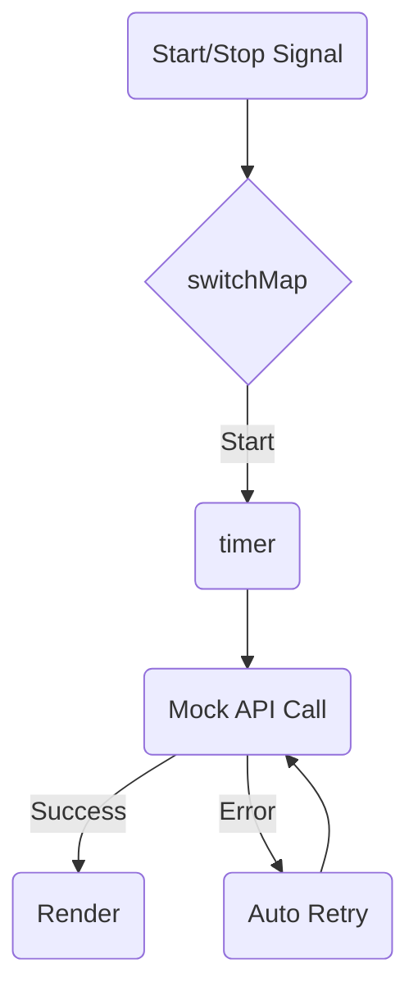

# Smart Polling Pattern

## 🌟 Tổng quan
Polling là kỹ thuật gọi API định kỳ để cập nhật dữ liệu mới nhất (ví dụ: Chat, Tin tức, Giá chứng khoán). Tuy nhiên, polling "ngây thơ" bằng `setInterval` thường gặp vấn đề:
- Không dừng được khi cần.
- Không xử lý được khi API bị chậm (Race condition).
- Không tự động retry khi lỗi.

## 💎 Giá trị cốt lõi
Pattern này sử dụng RxJS để giải quyết triệt để các vấn đề trên:
1.  **Pause/Resume**: Dễ dàng tạm dừng polling khi user switch tab hoặc minimize app.
2.  **Concurrency Control**: Dùng `switchMap` hoặc `exhaustMap` để đảm bảo không gọi chồng chéo API.
3.  **Error Handling**: Dùng `retry` hoặc `retryWhen` để tự động thử lại nếu API lỗi, không làm chết luồng polling.

## 🏗 Cấu trúc Pattern

## 💡 Ví dụ trong code
Xem file `polling.js`. Chúng ta sẽ xây dựng một Polling Service giả lập:
- Có nút Start/Stop.
- Gọi API giả (có tỷ lệ lỗi ngẫu nhiên).
- Tự động Retry nếu lỗi.
- Đảm bảo khoảng cách giữa các lần gọi là cố định (không bị trôi theo thời gian response).
